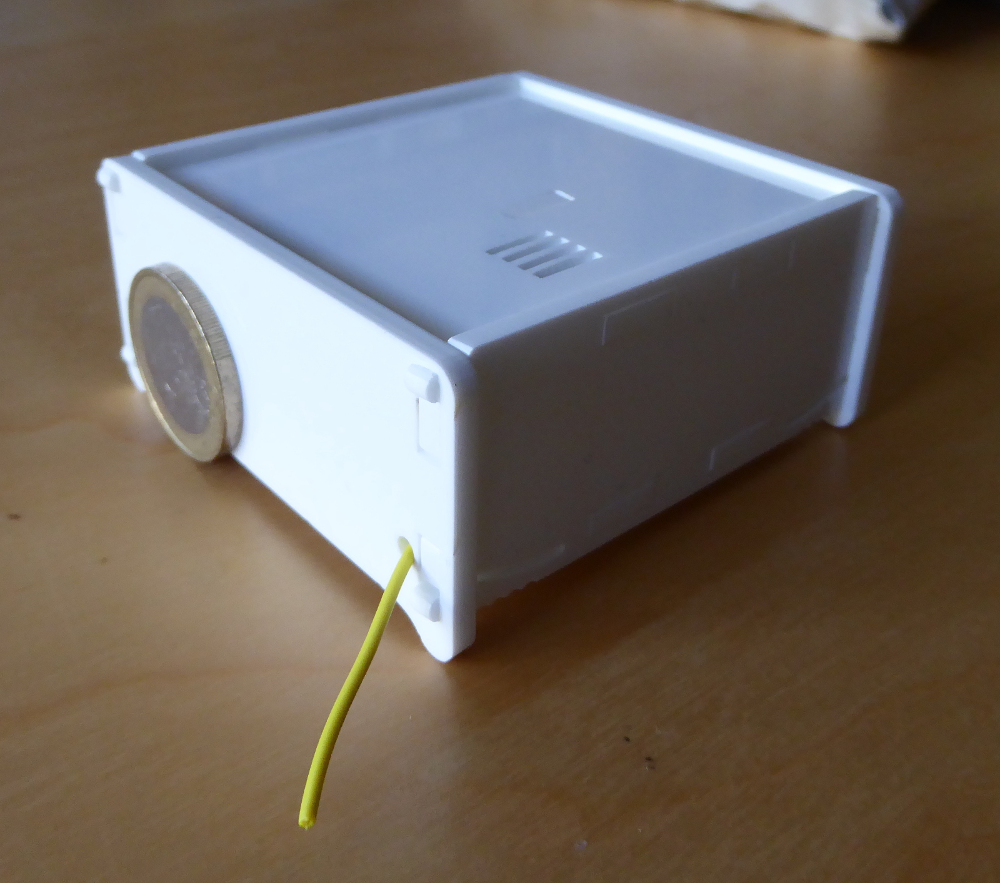
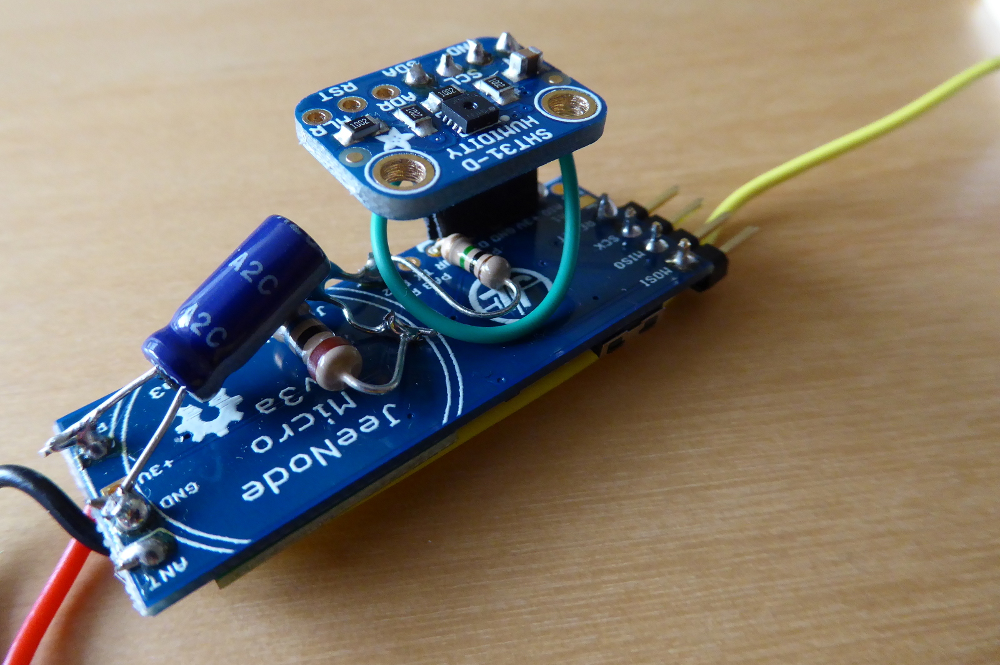
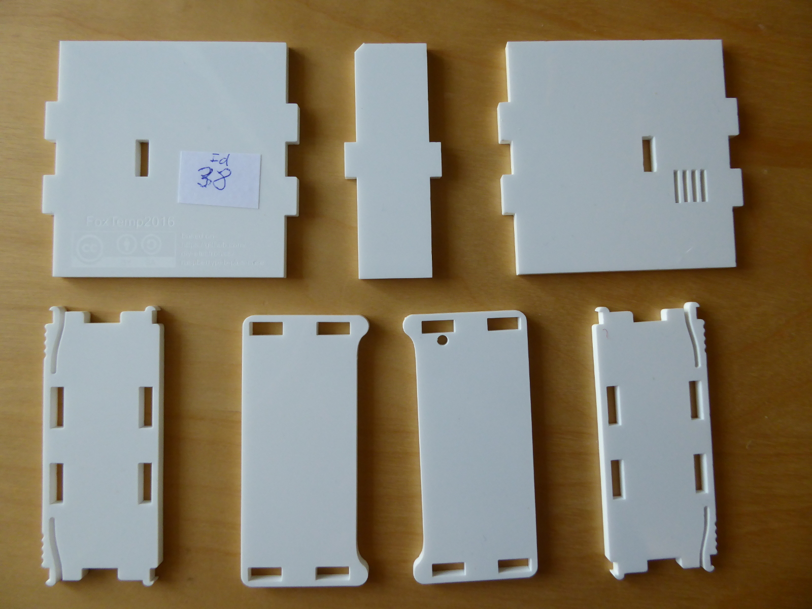
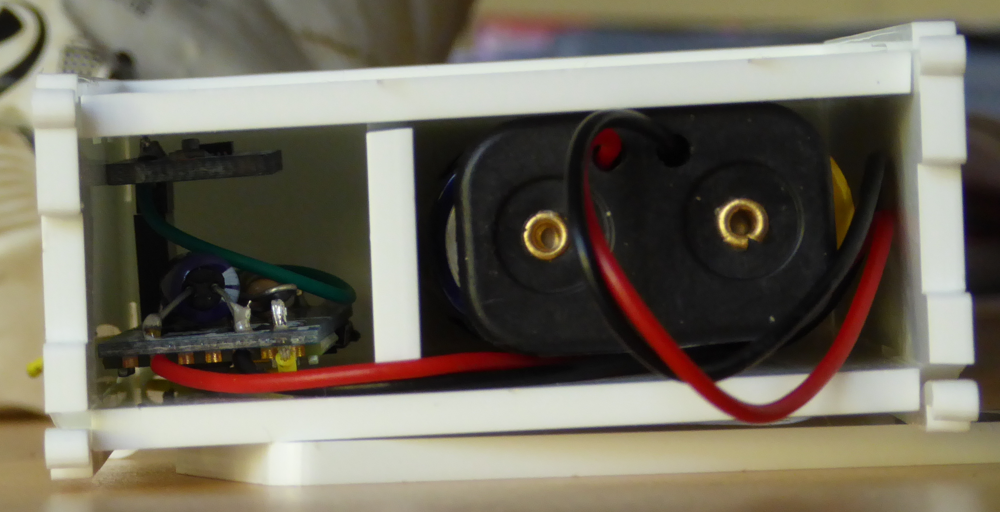
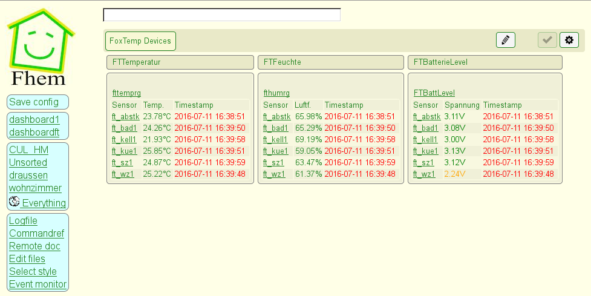

# Foxtemp 2016

## Intro

This repository contains info about, firmware and a case for the
FoxTemp-Device version 2016.

This is basically a wireless successor to
[my old ds1820tosub-project](https://www.poempelfox.de/ds1820tousb/), with
the following changes:
- Now wireless. Sadly, that means it needs to be powered by batteries
- uses a SHT31 as a sensor, not a DS1820. As a result of this, it
  can now also measure humidity - the datasheet of the SHT31 claims
  it can do this at a typical accuracy of &plusmn;2% RH in the relevant
  ranges. It also claims a typical accuracy of &plusmn;0.3&deg;C for
  the temperature measurement, so the accuracy is better than the
  &plusmn;0.5&deg;C the DS1820 promises.

Note that you will also need a way to receive the wirelessly transmitted
data. I simply used a [JeeLink](http://jeelabs.net/projects/hardware/wiki/JeeLink) v3c,
which is a simple USB transceiver for 868 MHz that is commonly used in
non-commercial home-automation systems. As such it is well supported by
FHEM, a popular non-commercial and cloud-free home-automation software.
A FHEM module for feeding temperature data from foxtemp2016 devices into
FHEM can also be found in this repository.




## Hardware

### Intro

This has been designed for low power usage, and when not transmitting the circuitry
uses only a fraction of a miliampere (around 0.06 mA at 2 volts input voltage,
this depends on the input voltage obviously). This should guarantee a long
battery life, but it's still unknown how long exactly this will be.
<i>Update November 2018:</i> I have now been running a bunch of
these devices for more than two years with one set of 2x AA batteries, and they
are currently at 2.7 volts, so probably will be good for some more time.
<i>Update January 2022:</i> I have now had to change the batteries in the first device,
because they did not deliver stable voltages anymore and I feared that they would
start to leak. So the runtime for this device was about 4.5 years with one set
of 2x AA batteries. The rest of the devices continue to run, but their battery voltages
are down to 2.3-2.4 volts by now, so I expect them to also give up within the
next months.

### BOM

The hardware uses as many "ready made" parts as possible and just slaps them
together. The bill of materials therefore is short:

* [JeeNode micro v3](http://jeelabs.org/jm3), which is
  an ATtiny84 based microcontroller module with an RFM12B 868 MHz
  wireless module. There are multiple versions of that, the one used
  here is the one with boost power, it includes a boost converter,
  which means it can be powered by anything from 1.0 to 5.0 volts
  and will generate the 3.0 volts the microcontroller and peripherals
  use from that.
* SHT31 temperature sensor, in the form of a
  [SHT31 breakout board by Adafruit](https://www.adafruit.com/product/2857).
  This is used because the SHT31 is very tiny, so soldering it directly
  without damaging it would not be an easy task, and because the breakout
  board serves perfectly as what would be called a "shield" in the Arduino
  world: It's plugged/stacked on top of the microcontroller board.
  A word of warning: In 2021, Adafruit made a new revision of their board,
  adding so called "STEMMA QT" connectors and a useless always-on LED
  wasting lots of power on an otherwise ultra-low-power circuitry. The
  outer dimensions have also changed, which could mean it no longer fits
  into the case (untested).
* a voltage divider for measuring the current voltage of the batteries, so you
  can tell how full they are. You cannot directly connect the batteries
  to an ADC pin of the microcontroller, because that runs at 3.0 volts,
  and two AA batteries when full are more like 3.2 volts. Of course, when
  you modify the design to use a power source that is guaranteed to have
  less than 3.0 volts at all times, you can skip that voltage divider and
  just connect power to PA2. You'll also have to make changes on the
  receiver software side, because that expects the values received to
  be on a scale of 0 to 3.3 volts, not 0 to 3.0 volts.
  * resistor 10 MOhm
  * resistor 1 MOhm
  * small capacitor. Everything >= 1 nF should be just fine, I used 100 nF
    because I had that lying around.
* Goobay 78467 battery tray. This is simply a battery holder for two
  AA / mignon batteries that has cables attached.
* an additional 100 uF capacitor for stabilizing power, simply soldered
  between the power pin and ground. This is completely
  optional. I added it because IMHO the capacitors on the JeeNode Micro
  are a bit short, and I actually had problems with the microcontroller
  crashing during transmission (when the radio module suddenly starts drawing
  a lot of power) when connected through a cheap multimeter (for measuring the
  current drawn) in a different project.
* 4pin angled pin strip for the ISP connector of the JeeNode micro
* 3pin (non-angled) pin strips male and female for connecting and mounting the
  SHT31 on top of the JeeNode micro.

### Putting it together

Wanting to keep things as simple and compact as possible, I soldered the few
parts directly together on top of the JeeNode micro (JNu). In the following
description, "top" means the side of the JNu with the radio module, the
microcontroller and the pushbutton, even if this is the side that will be
facing downwards later.

I used this sequence:
* solder the 4pin angled pin strip for the ISP connector (the
  MOSI/MISO/SCK/RESET-pins on the side opposite the radio module) to the
  JNu so the pins are on the top side of the JeeNode and face outwards.
* solder the battery tray cables to the 'P' (power) and 'G' (GND) pads next to
  the radio module on the JNu.
* solder the additional 100 uF capacitor between the solder points where you
  just soldered the battery tray cables, on the bottom of the JNu.
* solder the short antenna cable (included with the JNu) to the 'ANT' pad
  on the JNu.
* solder the voltage divider directly between the pins on the JNu, on
  the bottom. It goes between the the GND pad in the middle of the board,
  and the PWR and PA2 pads on the side. The schematic is simply as follows:

```
    PWR -----|
             |
           R 1 MOhm
             |
    PA2 -----|----------|
             |          |
          R 10 MOhm   C >= 1nF
             |          |
    GND -----|----------|
```

* connect the SHT31. Sadly, only 3 out of 4 pins on the SHT31 breakout board
  match our layout on the JNu. Therefore, you can use a 3x pin strip male and
  female to connect the SHT31-breakout-boards VIN, GND, SCL to '+3V', 'GND',
  PA0/DIO. I put the female header on the bottom of the JNu, and the male
  header on the bottom of the SHT31, so that when all is put together, the JNu
  lies top down, and the SHT31 is facing upwards.    
  For the fourth pin, just use a short wire. Connect 'SDA' on the breakout
  board to PA1/AIO on the JNu.

## Case




A reference design for a laser-cut case that will fit the sensor construction
and the batteries is also included. You can find the DXF file in the subdirectory
`case`. It's based on a
[DIY-lasercut-case-design for a Raspberry Pi B](https://github.com/diy-electronics/raspberrypi-b-plus-case/)
which in turn seems to be based on some [Adafruit](http://www.adafruit.com)
case. I merely shrunk the case and added holes so that the sensor can actually get
air from the room.

The dimensions of the case are about 68x66x30 mm and it is intended to be
cut from 3 mm thick acryl. The case can be assembled without any glueing,
the parts click together.

The case is not in any way suitable for outside use, it does not offer
any protection against water or dirt.

The license for the case is CC-BY-SA (due to the fact that the case
design I modified was also CC-BY-SA).

## Firmware

The firmware in this repo has been optimized for low power consumption.
It sends the microcontroller into deep sleep and uses the watchdog timer
to wake it up in regular intervals. This is possible because on the
ATtiny84 the WDT has a special mode in which it will just cause an
interrupt that is capable of waking the device from every sleep mode,
and only if the timer expires a second time before being reset it
will actually trigger a full device reset.

The device will transmit information every 24 or 32 seconds. It tries
to randomize that interval by using the lowest bit of the
Analog-Digital-Converter data as a random value (which it pretty much
is). The idea behind this is that if two devices start up at exactly the
same time, after a few minutes the time at which they transmit data
will spread out.

Since the SHT31 does need a little time to do the measurement,
the firmware uses a little trick to maximize the time the microcontroller
can spend in sleep: Instead of waiting for the SHT31 to complete
measurement, the firmware tells it to do the measurement just before
going to deep sleep, and then reads the result when waking up 24 or 32
seconds later. As a result, the values transmitted are actually values
as measured half a minute ago, so this is not suitable for anything
where you need a fast response time.

Each foxtemp2016-device needs to be given a unique ID of 8 bits. This is stored
in the EEPROM. If you set the ID in eeprom.c and recompile, you can
then flash the EEPROM from `foxtemp2016_eeprom.bin`/`.hex`. The
Makefile target uploadeeprom can serve as an example for how to do
this with a STK500. If the firmware does not find a configured ID
in the EEPROM, it will default to an ID of **3**, so you should never
use that ID.

The data format transmitted is based on the one found in the FHEM JeeLink
firmware as the format for custom sensors, it looks as follows:

| Offset (Byte) | Content  |
| ------------: | :------- |
|             0 | 0xCC     |
|             1 | Sensor-ID (0 to 255 / 0xff)   |
|             2 | Number of data bytes that follow (6) |
|             3 | Sensor Type, 0xf7 for FoxTemp2016 |
|             4 | Temperature MSB (raw value from SHT31) |
|             5 | Temperature LSB (raw value from SHT31) |
|             6 | Humidity MSB (raw value from SHT31) |
|             7 | Humidity LSB (raw value from SHT31) |
|             8 | Battery voltage (with the 10:1 voltage divider, this is on a scale from 0 = 0V to 0xff = 3.3V)  |
|             9 | Checksum |

The firmware is not in any way dependant on Arduino libraries
or tools, you just need avrlibc and avr-gcc.

Flashing the firmware onto the JNu is a bit tricky: it doesn't
have a bootloader (or a serial port you could talk to). You
will have to use an ISP programmer that supports a voltage of
3.0 volts, because that is what the microcontroller on the JNu
runs at. Due to space constraints, there also isn't a standard
6 pin ISP connector on it, just the 4 data pins are brought
out and you'll have to use power and ground pins elsewhere.
There is [some information about this upstream](http://jeelabs.org/2013/03/03/programming-the-jnu-v3-part-1/).

## Software

### FHEM module

The FHEM module can be found in the file `36_Foxtemp2016viaJeelink.pm`.
I'm not really proud of this one, it's a mess. Because there seems
to be no usable documentation on writing proper FHEM modules, I did
what everybody else seems to do: Copy an existing module and modify
it by trial and error until it somehow works.  
There are usage instructions at the top of that file, I'll repeat
them here:

The module is for use together with a JeeLink as a receiver.
On the JeeLink, you'll need to run a slightly modified version of the firmware
for reading LaCrosse (found in the FHEM repository as
`/contrib/36_LaCrosse-LaCrosseITPlusReader.zip`):  
It has support for a sensor type called "CustomSensor", but that is usually
not compiled in. There is a line  
   `CustomSensor::AnalyzeFrame(payload);`  
commented out in `LaCrosseITPlusReader10.ino` -
you need to remove the `////` to enable it, then recompile the firmware
and flash it onto the JeeLink.

You need to put `36_Foxtemp2016viaJeelink.pm` into `/opt/fhem/FHEM/`,
and to make it work, you'll also need to modify `36_JeeLink.pm`:
to the string "clientsJeeLink" append `:Foxtemp2016viaJeelink`.

Finally, to define a FoxTemp2016-sensor in FHEM, the command is  
  `define <name> Foxtemp2016viaJeelink <addr>`  
e.g.  
  `define kitchen FoxTemp2016viaJeelink 6`  
where addr is the ID of the sensor, either in decimal or
(prefixed with 0x) in hexadecimal notation.



### hostreceiverforjeelink

This is a small daemon written in C for serving the data received
from a foxtemp2016 device to the network, using a JeeLink v3c (or
one of the many compatible clones) as the receiver device.
This is the only part of this repository that keeps getting
updates, because over the years I have added support for receiving
many more of my projects to this little daemon, and by now it
would be warranted to break this out into its own repository.
However, I am lazy, so it will just keep on living here.

This now supports the following wireless sensors:
* foxtemp2016
* hawotempdev2016
* hawotempdev2018
* foxgeig2018
* foxstaub2018, 2022 edition
* foxtemp2022
* some relatively cheap commercial "LaCrosse" sensors. I mainly use Technoline TX29DTH-IT+, they work well for me.

This supports the following receivers, that need to be attached via USB:
* JeeLink v3c or one of the many clones, with the "LaCrosse IT plus reader" firmware intended for FHEM project. At the time of writing this, you can find the source for that on [the FHEM subversion in the contrib directory](https://svn.fhem.de/trac/browser/trunk/fhem/contrib/arduino/). You will probably need to recompile that firmware from source to enable support for "custom sensor".
* a CUL from busware.de, running [culfw](http://culfw.de/). You will need to modify the sourcecode of the firmware and recompile it, because otherwise it defaults to truncating received packets after 12 bytes, and some of our sensors send more than that. Modify the file `clib/rf_native.c` in culfw and increase <tt>CC1100_FIFOTHR</tt> from the default 2 to at least 4 (=20 Bytes). Unfortunately, in my experience, the CC1101 is a diva when it comes to reception, orders of magnitude more fragile than the RFM69 on the JeeLink. It can receive very weak signals, which is great, but it also has the tendency to automatically adjust its sensitivity down to absolutely zero if it receives any interfering noise. As a result, I have had great success in some locations, but massive reception problems in others, and would not recommend using this as a receiver.

To compile the hostreceiver, call `make hostreceiverforjeelink`.

```
usage: ./hostreceiverforjeelink [-v] [-q] [-d n] [-h] command <parameters>
 -v     more verbose output. can be repeated numerous times.
 -q     less verbose output. using this more than once will have no effect.
 -d p   Port to which the Jeelink is attached (default: /dev/ttyUSB2)
 -r br  Select bitrate mode. -1 makes the JeeLink toggle, 1 or 9579
        forces 9579 baud, 2 or 17241 forces 17241. The default 0 picks
        a value based on the selected sensors.
 -f     relevant for daemon mode only: run in foreground.
 -C     receiver device is not a Jeelink but a CUL, running culfw >= 1.67
 -h     show this help
Valid commands are:
 daemon   Daemonize and answer queries. This requires one or more
          parameters in the format
           [sensortype]sensorid:port[:outputformat]
          where sensorid is the sensor-id-number of a sensor;
          sensortype is one of: H for a hawotempdev2016 (this is also
          the default if you omit the type), F for a foxtempdev2016, L for some
          commercial sensors using the LaCrosse protocol, S for a foxstaub2018,
          G for a foxgeig2018;
          port is a TCP port where the data from this sensor is to be served
          The optional outputformat specifies how the
          output to the network should look like.
          Available are: %B = barometric pressure, %c = CPM 1 min,
          %C = CPM 60 min, %PM2.5u = PM 2.5u, %PM10u = PM 10u,
          %H = humidity, %L = last seen timestamp, %S = sensorid,
          %T = temperature. The default is '%S %T' even for sensors that
          don't even measure temperature.
          Examples: 'H42:31337'   'F23:7777:%T %H'
```

